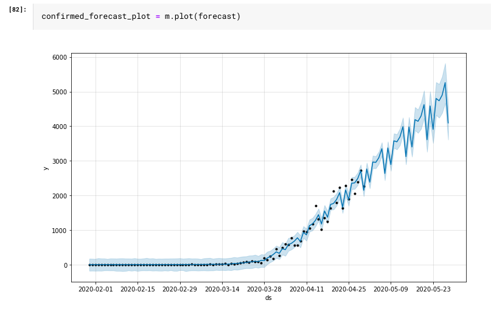

# COVID-19 Forecast using ARIMA in India
 
[In this notebook](https://github.com/sidoff8/Covid-19-in-India/blob/master/Corona%20Cases%20in%20India-Analysis%20.ipynb) we have projected the number of cases per day in india till 30 may, and many other important projections have been made, The note book is self-explanatory in nature and has wonderfull visulization, so why to wait lets directly dive into the [notebook on Kaggle](https://www.kaggle.com/bhrt97/corona-cases-in-india-analysis) as you cannot see visulisation here on github due to some constraints.

### Consider giving a upVote if you like the notebook <3

#### This is the Final Forecast which we have made 

